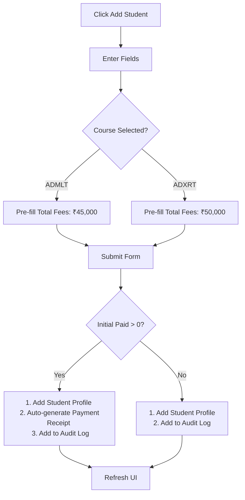
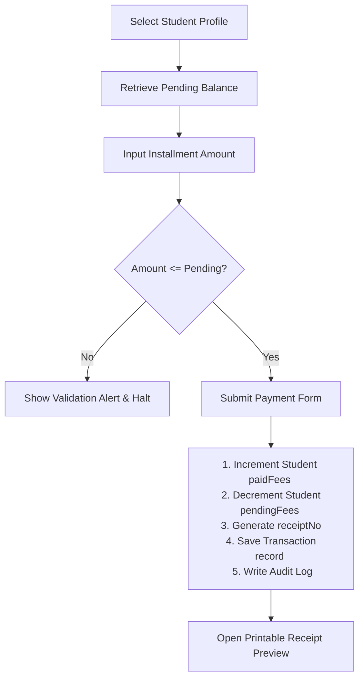
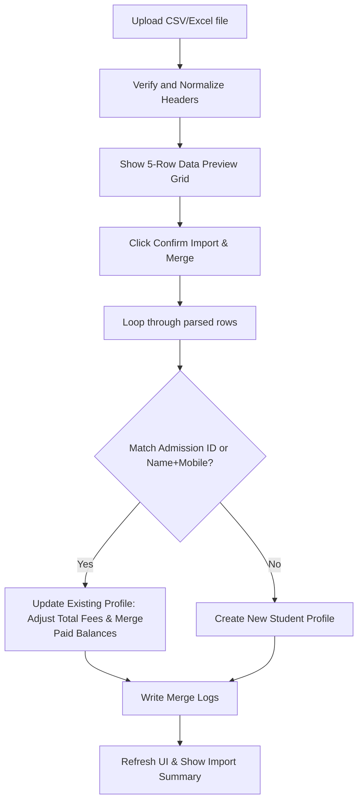

# PROJECT TRUTH - CPTC Fees Module

## Project Information
- **Project Name:** CPTC Fees Module (Chikhli Paramedical & Technology College, Chikhli)
- **Purpose:** A complete, modern, responsive, and easy-to-use Student Fee Management System tailored for non-technical administrative staff.
- **Scope:** Handles staff logins, student registration, installment tracking, real-time metrics dashboards, Excel/CSV merging, ledger reports, receipt generation, and backup administration.

---

## 1. Architecture Overview

The application is structured as a **Native HTML5 & ES6 Modules Single Page Application (SPA)** that runs client-side with zero build tool dependencies.

### Key Architectural Choices:
1. **No-Build ESM Component Tree:** Native JavaScript modules (`import/export`) organize components into clean views. They run directly in modern browsers without webpack, Babel, or Vite compile steps.
2. **Reactive Render Loop:** Centralized in `app.js`. State modifications trigger a clean top-down DOM redraw (`renderApp`), ensuring data representations remain synchronized across all views (e.g. updating a balance updates the dashboard, reports, and student list tables instantly).
3. **Dual Data Service Layer:** Unified in `dbService.js`. Implements identical CRUD APIs for both LocalStorage (offline mockup preloaded with mock data) and Firebase (Firestore + Authentication). The app automatically falls back to offline LocalStorage mode if Firebase keys are absent.
4. **MIME-Aware PowerShell Local Server:** Handles MIME mapping (e.g. `.js` to `application/javascript`, `.css` to `text/css`) to support ES Modules and bypass browser CORS limitations when running locally on Windows.
5. **SheetJS Parsing:** Native client-side binary parsing of `.xlsx` and `.csv` sheets using SheetJS loaded via CDN, avoiding backend dependencies.
6. **Print Styling (`@media print`):** Custom CSS overrides isolate receipt vouchers and report tables for perfect physical printing (e.g., hiding menus, buttons, background cards).

### Directory Structure
```
college-fees-app/
├── index.html                   # Application entry mount point
├── start_server.ps1             # Local .NET-based HTTP web server script
├── PROJECT_TRUTH.md             # This truth file
└── src/
    ├── app.js                   # Application coordinator and reactive render loop
    ├── firebaseConfig.js        # Firebase credentials definition
    ├── components/
    │   ├── Login.js             # User login and credentials selector
    │   ├── Dashboard.js         # Collection metrics, course meters, overdue panel
    │   ├── StudentList.js       # Roster table, search filtering, and delete trigger
    │   ├── StudentFormModal.js  # Add and edit student profiles forms
    │   ├── FeesDesk.js          # Installment form, transaction log, and print receipt modal
    │   ├── Reports.js           # Daily, monthly, pending, and ledger reports
    │   ├── AdminConsole.js      # User management, audit logs, and JSON backups
    │   └── ExcelImport.js       # Upload drop-zone, XLSX parser, merge review
    ├── services/
    │   ├── dbService.js         # Firestore & LocalStorage dual-mode database
    │   └── translationService.js # English & Marathi dictionary lookups
    └── styles/
        └── index.css            # Light/Dark stylesheet, grids, layout, print directives
```

---

## 2. Data Model Definitions

### A. Student Profile (`students`)
```typescript
interface Student {
  id: string;               // Unique database/LocalStorage ID (e.g. std-1698234)
  admissionId: string;      // Unique college admission ID (e.g. CPTC-2026-104)
  name: string;             // Student full name
  mobile: string;           // Student contact number (10 digits)
  parentMobile: string;     // Parent/Secondary contact number (10 digits)
  course: "ADMLT" | "ADXRT"; // Course enrollment
  batch: string;            // Academic Year (e.g. "2025-2026")
  totalFees: number;        // Total fees expected for the course (₹)
  paidFees: number;         // Accumulated paid fees (₹)
  pendingFees: number;      // Outstanding balance (₹) [Calculated: Total - Paid]
  status: "Active" | "Completed" | "Suspended";
  createdAt: string;        // ISO 8601 Timestamp
}
```

### B. Installment Receipt (`transactions`)
```typescript
interface Transaction {
  id: string;               // Unique transaction ID (e.g. tx-1698234)
  studentId: string;        // Associated Student ID foreign key
  studentName: string;      // Denormalized student name (for transaction persistence)
  admissionId: string;      // Denormalized student admission ID
  course: "ADMLT" | "ADXRT";
  receiptNo: string;        // Unique receipt number (e.g. REC-2026-1002)
  amount: number;           // Paid installment amount (₹)
  paymentMethod: "Cash" | "UPI" | "Card" | "Net Banking";
  transactionId: string;    // UPI transaction ID / Bank Ref Reference number (optional)
  date: string;             // ISO 8601 Timestamp
  collectedBy: string;      // Name of the logged-in staff member
  remarks: string;          // Ledger notes (e.g. "Term 1 Fees", "Exam Fee")
}
```

### C. Audit Trail (`logs`)
```typescript
interface AuditLog {
  id: string;               // Log entry ID
  timestamp: string;        // ISO 8601 Timestamp
  userName: string;         // Logged in staff user name
  action: string;           // Details of action taken (e.g. "Added student Atul...")
  type: "payment" | "student_create" | "student_edit" | "student_delete" | "excel_import" | "backup" | "login" | "system";
}
```

---

## 3. Core Business Rules

### Critical Financial Integrity Rules

#### Rule: Initial Admission Payment
- The initial admission payment must create exactly one transaction.
- Student creation must never create duplicate payment records.
- Editing a student must never regenerate or recreate admission transactions.

#### Rule: Transaction Reference Integrity
- The `transactionId` (UPI Ref / Bank Transaction ID) must be unique when provided.
- Duplicate `transactionId` values must be rejected with an error during payment entry.

#### Rule: Receipt Integrity
- The `receiptNo` must be generated exactly once upon transaction creation and never modified.
- Reprinting a receipt or opening the receipt voucher preview must not create a new transaction or modify data in any way.

#### Rule: Student Balance Integrity
- The student's `paidFees` must always equal the sum of all transaction amounts logged for that student.
- The student's `pendingFees` must always equal `totalFees - paidFees`.
- Negative `pendingFees` are strictly forbidden (`pendingFees >= 0`). Total fees cannot be set lower than already paid fees.

#### Rule: Duplicate Prevention
- A payment submission button must become disabled immediately after the first click.
- Multiple clicks must never create multiple transactions or logs.

---

### Core System Roles & Permissions

Three distinct tiers of staff privileges:
- **Super Admin (Owner):** Full administrative controls. Can manage staff directories, configure users, download/restore database backups, delete student records, and read security logs.
- **Admin (Manager):** Can register students, edit student profiles, import ledgers, log collections, and view reports. Cannot delete students, modify staff accounts, or view security logs.
- **Clerk/Operator:** Can search students, collect installments, and print receipts. Cannot edit/delete student records, view monthly aggregate reports, or import spreadsheets.

---

## 4. Key Workflows

### A. Student Manual Enrollment


### B. Installment Payment Collection


### C. Spreadsheet Import & Merge


---

## 5. Validation Rules

1. **Name:** String, cannot be blank. Stripped of leading/trailing whitespaces.
2. **Mobile Numbers:** Must contain exactly 10 numeric digits (`^[0-9]{10}$`).
3. **Financial Fields:** Must be positive integer values (`>= 0`).
4. **Installment Cap:** An installment amount must be greater than zero and less than or equal to the student's remaining outstanding fees (`0 < amount <= pendingFees`).
5. **Course Parameter:** Restricted to `"ADMLT"` or `"ADXRT"`.
6. **Unique ID Matching:** Checking for duplicate admission numbers must ignore case formatting.

---

## 6. Developer Guidelines

### Prohibited Side Effects & Anti-Patterns:
1. **Never mutate state directly without triggering a render update:** Updates must pass through `updateState({ ... })` to keep the UI in sync.
2. **Do not create transaction entries without valid student IDs:** Transactions must link back to a valid student profile.
3. **Avoid double collection logs:** Disable the payment submission button immediately upon click to prevent double clicks from logging duplicate installments.
4. **Do not calculate balances in components:** Calculate remaining balances (`totalFees - paidFees`) in the service layer or database service prior to writing.
5. **Respect role boundaries:** Always check `state.user.role` before rendering buttons or processing operations that modify data (e.g. student deletion, user management).

### Verification Checklist:
- Run `start_server.ps1` to test the local web server.
- Verify that changing language translating triggers translate keys in both English and Marathi dynamically.
- Test both light and dark mode toggles.
- Verify the printable layout with `@media print` using the system print dialog.
- Confirm that uploading CSV files merges existing student data and registers new profiles correctly without creating duplicates.
